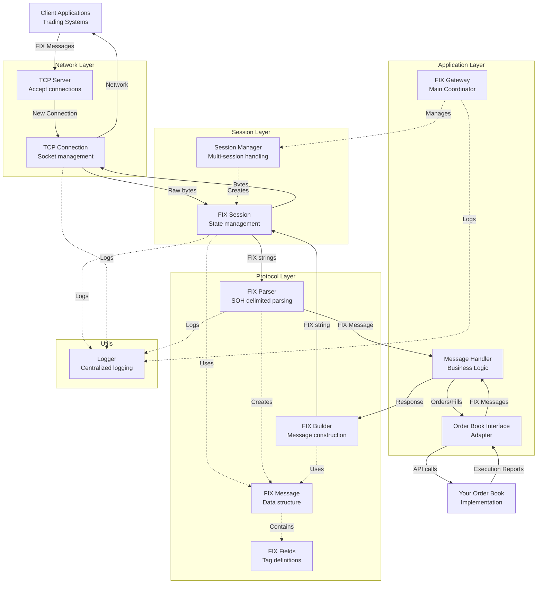
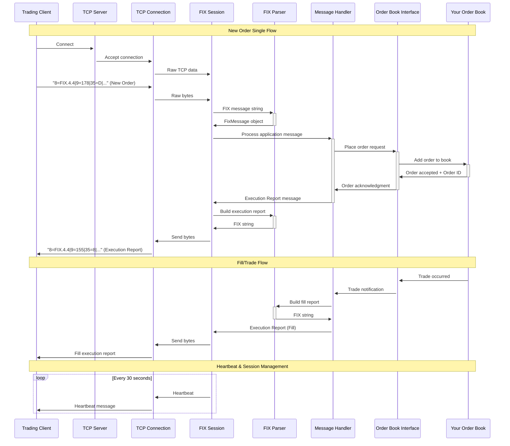

# FIX Gateway C++ Architecture

## Project Overview

This is a modular FIX 4.4 gateway implementation in C++ designed for hedge fund trading operations. The gateway follows a layered architecture approach from TCP connections at the bottom to application logic at the top.

> **📋 Development Roadmap**: This project follows a phased evolution plan from basic TCP connectivity to production-grade performance. See [DEVELOPMENT_ROADMAP.md](DEVELOPMENT_ROADMAP.md) for the complete journey from current implementation to sub-10μs latency with core pinning and lock-free queues.

## Current Implementation Status

✅ **Completed**: TCP Connection Layer with thread-safe send/receive
✅ **Completed**: Performance instrumentation and baseline measurement (Phase 1)
🚧 **In Progress**: Async send architecture with message prioritization (Phase 2)
📋 **Planned**: Lock-free queues, core pinning optimization

**Performance Target**: Sub-10μs message latency suitable for hedge fund trading operations.
**Current Baseline**: 1.22μs mean latency, 822K messages/sec throughput (M1 Max)

## Directory Structure

```
fix-gateway-cpp/
├── CMakeLists.txt                    # Main build configuration
├── README.md                         # Project overview
├── docs/
│   └── ARCHITECTURE.md              # This file - architecture documentation
├── config/
│   └── fix_gateway.conf             # Runtime configuration
├── include/                         # Header files
│   ├── network/                     # Network Layer
│   │   ├── tcp_connection.h         # TCP socket management
│   │   └── tcp_server.h             # Accept incoming connections
│   ├── session/                     # Session Layer
│   │   ├── fix_session.h            # FIX session state management
│   │   └── session_manager.h        # Handle multiple sessions
│   ├── protocol/                    # Protocol Layer
│   │   ├── fix_message.h            # FIX message data structure
│   │   ├── fix_parser.h             # Parse SOH-delimited FIX messages
│   │   ├── fix_builder.h            # Build FIX messages
│   │   └── fix_fields.h             # FIX 4.4 field definitions
│   ├── application/                 # Application Layer
│   │   ├── fix_gateway.h            # Main gateway coordinator
│   │   ├── message_handler.h        # Business logic processor
│   │   └── order_book_interface.h   # Interface to your order book
│   └── utils/                       # Utilities
│       └── logger.h                 # Centralized logging
└── src/                            # Source implementations
    ├── main.cpp                    # Application entry point
    ├── network/
    │   ├── CMakeLists.txt          # Network module build
    │   ├── tcp_connection.cpp      # TCP connection implementation
    │   └── tcp_server.cpp          # TCP server implementation
    ├── session/
    │   ├── CMakeLists.txt          # Session module build
    │   ├── fix_session.cpp         # FIX session implementation
    │   └── session_manager.cpp     # Session manager implementation
    ├── protocol/
    │   ├── CMakeLists.txt          # Protocol module build
    │   ├── fix_message.cpp         # FIX message implementation
    │   ├── fix_parser.cpp          # FIX parser implementation
    │   └── fix_builder.cpp         # FIX builder implementation
    ├── application/
    │   ├── CMakeLists.txt          # Application module build
    │   ├── fix_gateway.cpp         # Main gateway implementation
    │   ├── message_handler.cpp     # Message handler implementation
    │   └── order_book_interface.cpp # Order book interface implementation
    └── utils/
        ├── CMakeLists.txt          # Utils module build
        └── logger.cpp              # Logger implementation
```

## Layered Architecture

The gateway is designed with a clear separation of concerns across four main layers:

### 1. Network Layer (Bottom)

- **TCP Connection**: Manages individual socket connections
- **TCP Server**: Accepts incoming client connections
- Handles raw byte streams and connection lifecycle

### 2. Session Layer

- **FIX Session**: Manages FIX protocol session state (logon, heartbeats, sequence numbers)
- **Session Manager**: Coordinates multiple concurrent FIX sessions
- Handles FIX administrative messages and session recovery

### 3. Protocol Layer

- **FIX Parser**: Parses SOH-delimited FIX messages into structured data
- **FIX Builder**: Constructs FIX messages from structured data
- **FIX Message**: In-memory representation of FIX messages
- **FIX Fields**: FIX 4.4 field tag definitions and constants

### 4. Application Layer (Top)

- **FIX Gateway**: Main coordinator and entry point
- **Message Handler**: Business logic for processing trading messages
- **Order Book Interface**: Adapter to integrate with your existing order book

## Architecture Diagram



## Message Flow Sequence



## Module Dependencies

The dependency graph follows a strict bottom-up approach:

```
Application Layer
    ↓ depends on
Protocol Layer
    ↓ depends on
Session Layer
    ↓ depends on
Network Layer
```

**Utils** (Logger) is used by all layers but depends on none.

## Key Design Principles

1. **Modularity**: Each layer has clear responsibilities and interfaces
2. **Testability**: Each module can be unit tested independently
3. **Scalability**: Session manager can handle multiple concurrent FIX sessions
4. **Standard Compliance**: Follows FIX 4.4 specification exactly
5. **Integration Ready**: Clean interface to plug in existing order book systems
6. **Performance**: Designed for low-latency trading environments
7. **Maintainability**: Clear separation of concerns and well-defined APIs

## Implementation Order

Recommended implementation sequence (bottom-up):

1. **Utils**: Logger for debugging
2. **Network Layer**: TCP connection and server
3. **Protocol Layer**: FIX message parsing and building
4. **Session Layer**: FIX session management
5. **Application Layer**: Business logic and order book integration
6. **Main**: Tie everything together

## FIX 4.4 Message Types Supported

The gateway will handle these core FIX 4.4 message types:

- **Administrative**: Logon (A), Logout (5), Heartbeat (0), Test Request (1)
- **Order Management**: New Order Single (D), Order Cancel Request (F), Order Cancel/Replace Request (G)
- **Execution**: Execution Report (8)
- **Market Data**: Market Data Request (V), Market Data Snapshot (W) [optional]

## Configuration

The `config/fix_gateway.conf` file will contain:

- Network settings (ports, bind addresses)
- FIX session parameters (heartbeat intervals, sequence number management)
- Order book integration settings
- Logging configuration
